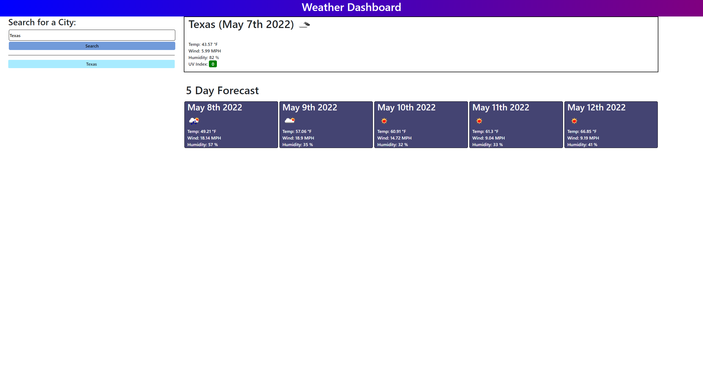

Greetings!

Thank you for checking out my weather forecast app!

Users are able to search up cities and determine the current weather forecast of that location as well as a 5 day weather
forecast for that location. The app is able to display temperature, wind speed, humidity, and UV index. It will also list
previous searched up locations.

Moment.js was utilized to get current date as well as set the date for the following 5 days. Openweather API was utilized
as the main source of gathering data.

I hope you enjoy, thank you!

You can find this project at https://yippeejimmee.github.io/Weather-Dashboard/

